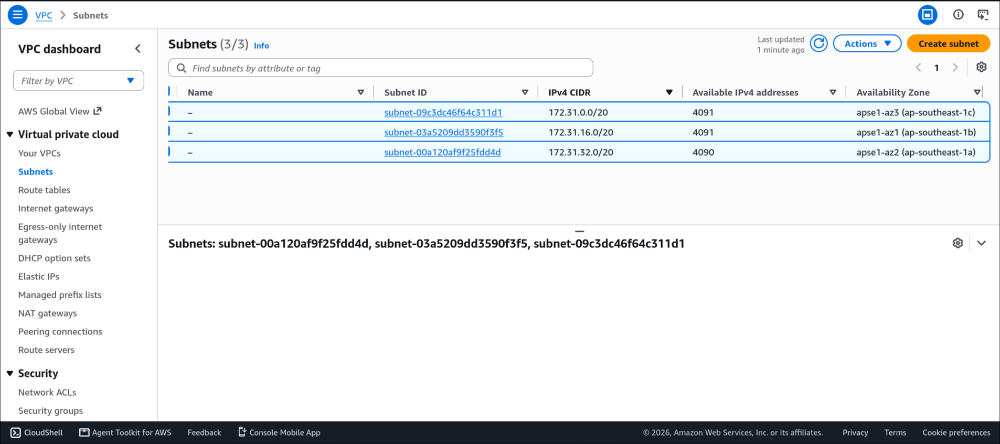
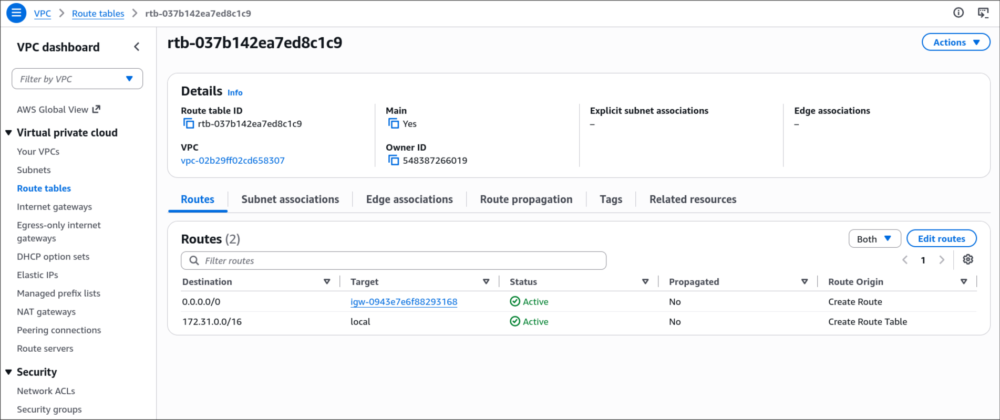
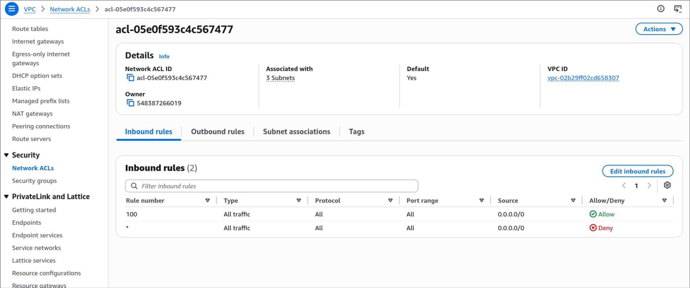
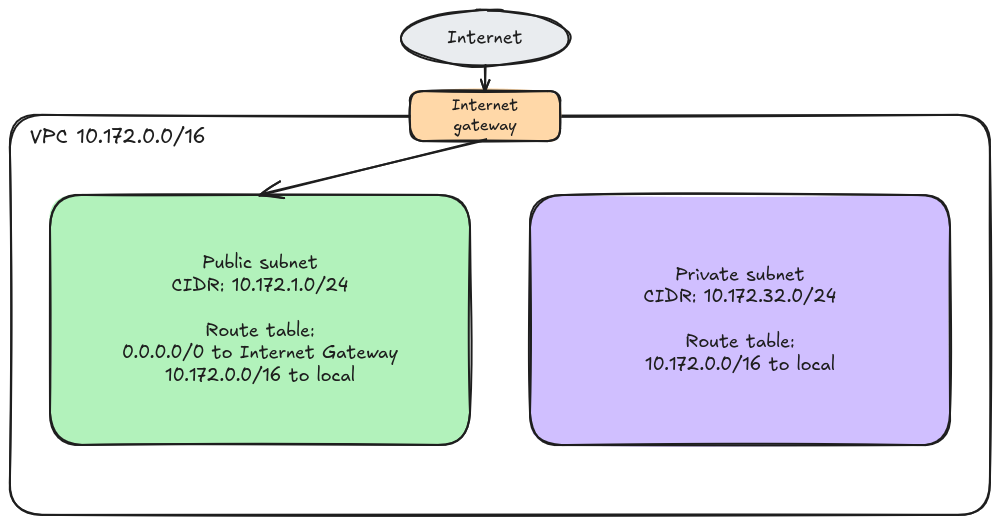

# Assignment 2 Submission

<!--
How to use this template:

1. Copy this file to submissions/assignment-2/<your-github-username>/submission.md
2. Replace every answer placeholder with your own answer. Delete the angle brackets too.
3. Save your four images in the same folder, with the exact file names below.
4. Do not write your full name or your student number in this file.
-->

## About me

- GitHub username: TrishchanJimenez
- Section: IV-DCSAD
- IAM user name that I signed in with: dcsad-g05
- X: 172

---

## Part A. Explore

### A1. The VPC

Default VPC IPv4 CIDR:

172.31.0.0/16

Number of addresses in that CIDR:

65,536

### A2. The subnets

| Availability Zone | IPv4 CIDR |
| --- | --- |
| apse1-az2 (ap-southeast-1a)  |172.31.32.0/20  |
| apse1-az1 (ap-southeast-1b)|172.31.16.0/20|
| apse1-az3 (ap-southeast-1c)  |172.31.0.0/20  |

Screenshot 1. Save it as `screenshot-1-subnets.png` in your folder. The image line below shows it.

### A3. Available addresses

Available IPv4 addresses in each subnet:

4091, 4091, 4090

Why is the number lower than 4,096?

Because AWS keeps 5 addresses in every subnet, the first four and the last one. Since the subnets have a /20 subnet they only have 4,091 available ip addresses.

What uses the missing address in the subnet with the lowest number?

The subnet with 4090 available addresses is missing an address because it has allocated one to an ec2 instance 

### A4. The route table

| Destination | Target |
| --- | --- |
| 0.0.0.0/0 | igw |
| 172.31.0.0/16 | local |

Screenshot 2. Save it as `screenshot-2-routes.png` in your folder. The image line below shows it.

### A5. Public or private

Are the default subnets public or private? Which route proves it?

It is public due to the 0.0.0.0/0 route to the internet gateway

### A6. The internet gateway

State of the internet gateway:

Attached

What happens to the default subnets if the gateway is detached?

They will lose internet connection

### A7. NAT gateways

Number of NAT gateways:

0

Can a server in a new private subnet download updates? Why?

It cannot download updates because the private subnet lacks a route to an Internet Gateway, and without a NAT Gateway, the server cannot send the requests needed to fetch the updates

### A8. The network ACL

| Rule number | Source | Allow or Deny |
| --- | --- | --- |
| 100 | 0.0.0.0/0 | Allow |
| * | 0.0.0.0/0 | Deny |

How is a network ACL different from a security group?

A security group is a firewall that applies directly to a resource, and only has allow rules. While, network ACL is a firewall that applies to a whole subnet, and has both allow and deny rules. 

Screenshot 3. Save it as `screenshot-3-network-acl.png` in your folder. The image line below shows it.

### A9. The default security group

Inbound rule (type and source):

Type: All traffic; Source: sg-0c5b6d4081cf0a534

Which resources can send traffic to an instance that uses it?

Only resources that have the sg-0c5b6d4081cf0a534 security group directly attached to them can send traffic to it.

---

## Part B. Prepare

### B1. Plan two subnets

- Public subnet CIDR: 10.172.1.0/24
- Private subnet CIDR: 10.172.32.0/24

### B2. Route tables

Route table of the public subnet:

| Destination | Target |
| --- | --- |
| 10.172.0.0/16 | local |
| 0.0.0.0/0 | igw |

Route table of the private subnet:

| Destination | Target |
| --- | --- |
| 10.172.0.0/16 | local |

### B3. My VPC diagram

Tool used (Excalidraw, draw.io, Lucidchart, or paper):

Excalidraw

Save your diagram as `vpc-diagram.png` in your folder. The image line below shows it.

### B4. Predict a change

Can you still open the web page from your laptop? Why?

No, I can't open it because there is no path to the Internet Gateway. The instance can't return any response to my laptop over the internet.

Can the instance still reach another instance in the VPC? Why?

Yes, because the route table still retains the default local route, which allows all traffic within the VPC CIDR block to communicate

### B5. Place a database

Which subnet gets the database? Why?

I'll put it in a private subnet because the database might contain sensitive information and should not be directly accessible from the internet. Placing it in a private subnet allows other resources within the same VPC to access it while blocking any external traffic.

### B6. My question about VPCs

What is your question, and what made you think of it?

Question:
What happens if a network runs out of available IP addresses within its initial CIDR block?

What made me think of it:
A CIDR block like /16 provides 65k addresses, which seems like a lot, but it is still a limited number. So I wondered what happens if you hit that limit, do you need to overhaul the network architecture or does AWS provide easy solutions for that.
